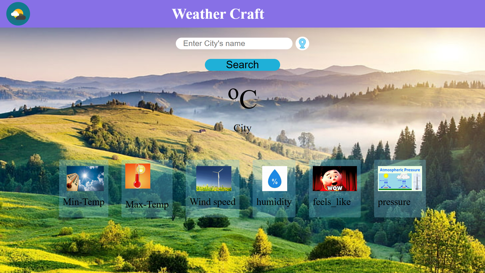
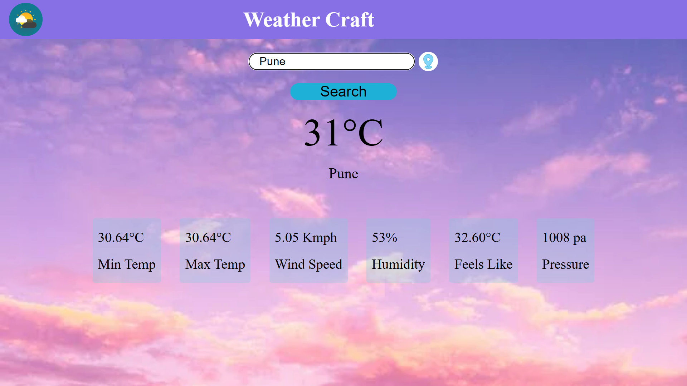
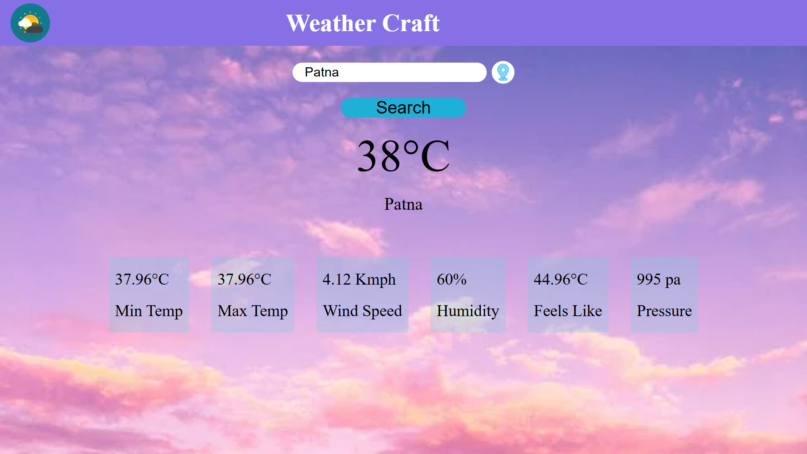

# know-weather-of-your-city


## Overview
"know-weather-of-your-city
" is a web application that provides real-time weather information for any city. The app is built using HTML, CSS, and JavaScript, and it fetches weather data from a weather API.

version 1 is hosted [HERE!](https://anandraj012.github.io/know-weather-of-your-city/)

## Features

- Real-time weather updates
- Temperature, humidity, wind speed, and more
- Weather forecast
- Responsive design for mobile and desktop users

## Technologies Used

- HTML
- CSS
- JavaScript
- Weather API (e.g., OpenWeatherMap)

## Usage
Enter the name of your city in the input field.
Click the "Search" button.
View the current weather and forecast for your city.

## Screenshot
 



## Getting Started

To get a local copy up and running, follow these steps:

### Prerequisites

- A web browser
- Internet connection

## Getting Started

These instructions will get you a copy of the project up and running on your local machine for development and testing purposes.

### VS Code Setup

To set up the project in Visual Studio Code (VS Code):

1. If you haven't already, download and install VS Code from [here](https://code.visualstudio.com/).

2. Open VS Code.

3. Open the cloned project directory in VS Code:

   - Click on `File` > `Open Folder...`
   - Navigate to the `know-weather-of-your-city` folder and click `Select Folder`.

4. Open the `index.html` file in VS Code to start working on the project.

### Installation

1. Clone the repository:

   ```sh
   git clone https://github.com/ANANDRAJ012/know-weather-of-your-city.git


Feel free to explore and build upon this project to create a fully functional e-commerce application. For any questions or assistance, please don't hesitate to reach out to us. Happy coding and happy shopping!

